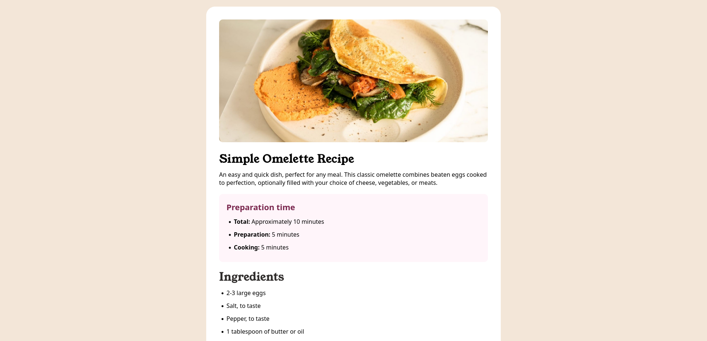
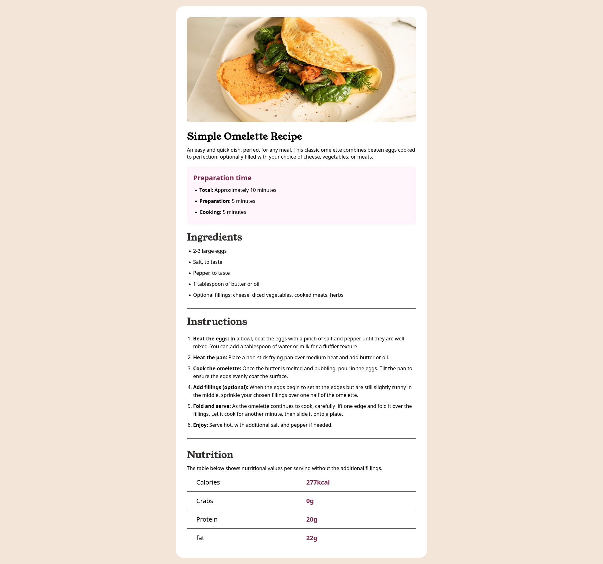

# Frontend Mentor - Recipe page solution

This is a solution to the [Recipe page challenge on Frontend Mentor](https://www.frontendmentor.io/challenges/recipe-page-KiTsR8QQKm). Frontend Mentor challenges help you improve your coding skills by building realistic projects. 

## Table of contents

- [Overview](#overview)
  - [The challenge](#the-challenge)
  - [Screenshot](#screenshot)
  - [Links](#links)
- [My process](#my-process)
  - [Built with](#built-with)
  - [What I learned & Continued development ](#what-i-learned)
- [Author](#author)
- [Acknowledgments](#acknowledgments)

## Overview

### Screenshot

### Links

- Solution URL: [https://github.com/Samm24TT/recipe-page-main]
- Live Site URL: [https://recipe-page-main-nine-orpin.vercel.app/]

## My process

### Built with

- Semantic HTML5 markup
- CSS custom properties
- Flexbox

### What I learned & Continued development
I learn html skills by doing this and I'll try to improve my code day by day.

## Author

- Frontend Mentor - [@Samm24TT](https://www.frontendmentor.io/profile/Samm24TT)

## Acknowledgments
- I want to give credit to:

  - Frontend Mentor 
  - For providing this well-designed challenge that helped me practice real-world frontend development skills
